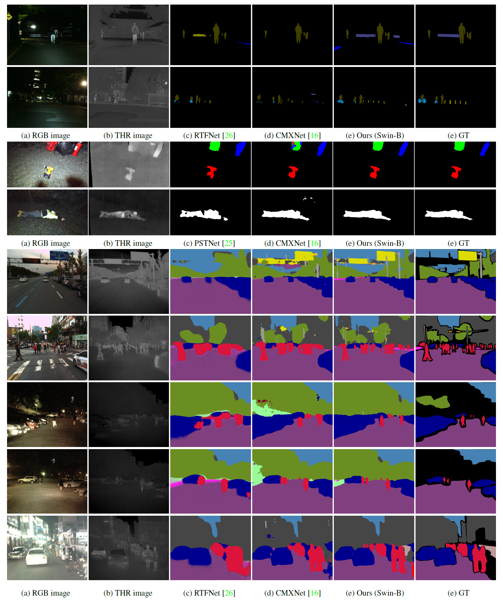

# Complementary Random Masking for RGB-T Semantic Segmentation

[](https://paperswithcode.com/sota/thermal-image-segmentation-on-mfn-dataset?p=complementary-random-masking-for-rgb-thermal)

[](https://paperswithcode.com/sota/thermal-image-segmentation-on-kp-day-night?p=complementary-random-masking-for-rgb-thermal)

[](https://paperswithcode.com/sota/thermal-image-segmentation-on-pst900?p=complementary-random-masking-for-rgb-thermal)

This is the official pytorch implementation of the paper:

 >Complementary Random Masking for RGB-T Semantic Segmentation
 >
 >[Ukcheol Shin](https://ukcheolshin.github.io/), Kyunghyun Lee, In So Kweon
 >
 >[[Paper](https://arxiv.org/abs/2303.17386)] [[Project page](https://sites.google.com/view/crm4rgbtseg/)]

### Semantic Segmentation Result on MFNet, PST900, KAIST Pedestrian(KP) datasets


Further visualization can be found in the video.

[](https://youtu.be/ltGiXhrqqLI)

### Updates
- 2023.03.30: Release evaluation code and pre-trained weights.
- 2023.12.19: Release training code

## Usage
### Installation
This codebase was developed and tested with the following packages. 
- OS: Ubuntu 20.04.1 LTS
- CUDA: 11.3
- PyTorch: 1.10.1
- Python: 3.9.16
- Detectron2: 0.6

You can build your conda environment with the provided YAML file.
```bash
conda env create --file environment.yml
```

Or you can build it manually.
```bash
conda create pytorch==1.10.1 torchvision==0.11.2 cudatoolkit=11.3 -c pytorch -c conda-forge --name CRM
conda activate CRM
python -m pip install detectron2 -f \
  https://dl.fbaipublicfiles.com/detectron2/wheels/cu113/torch1.10/index.html
pip install mmcv==1.7.1 pytorch-lightning==1.9.2 scikit-learn==1.2.2 timm==0.6.13 imageio==2.27.0 setuptools==59.5.0
```

If you want to test this codebase in another software stack, check the following compatibility:
- [PyTorch](https://pytorch.org/get-started/previous-versions/)
- [Detectron2](https://detectron2.readthedocs.io/en/latest/tutorials/install.html)
- [PyTorch Lightning](https://lightning.ai/docs/pytorch/latest/versioning.html#compatibility-matrix)
 

After building conda environment, compile CUDA kernel for MSDeformAttn.
If you have trouble, refer [here](https://github.com/facebookresearch/Mask2Former/blob/main/INSTALL.md)
```
cd models/mask2former/pixel_decoder/ops/
sh make.sh
```

### Dataset

Download datasets and place them in 'datasets' folder in the following structure:
- [MF dataset](https://www.mi.t.u-tokyo.ac.jp/static/projects/mil_multispectral/) or [RTFNet preprocessed version](http://gofile.me/4jm56/CfukComo1)
- [PST900 dataset](https://github.com/ShreyasSkandanS/pst900_thermal_rgb)
- [KP dataset](https://github.com/SoonminHwang/rgbt-ped-detection), [Segmentation label](https://github.com/yeong5366/MS-UDA) or [Pre-organized KP dataset](https://kaistackr-my.sharepoint.com/:u:/g/personal/shinwc159_kaist_ac_kr/EUfmm7hkeaVNuyyYsREttFIBGZ3u_tCmaZ5S5EYghwkKnQ?e=Gyc86F)

Since the original KP dataset has a large volume (>35GB) and requesting labels takes time, we recommend to use our pre-organized dataset (includes labels as well).

```shell
<datasets>
|-- <MFdataset>
    |-- <images>
    |-- <labels>
    |-- train.txt
    |-- val.txt
    |-- test.txt
    ...
|-- <PSTdataset>
    |-- <train>
        |-- rgb
        |-- thermal
        |-- labels
        ...
    |-- <test>
        |-- rgb
        |-- thermal
        |-- labels
        ...
|-- <KPdataset>
    |-- <images>
        |-- set00
        |-- set01
        ...
    |-- <labels>
    |-- train.txt
    |-- val.txt
    |-- test.txt
    ...
```

### Training

1. Download SwinTransformer backbone weights pretrained in ImageNet and convert its format for Mask2Former compatibility:
```bash
cd pretrained
sh download_backbone_pt_weight.sh
sh convert_pth_to_pkl.sh
```

2. Train a model with the config file.
If you want to change hyperparamter (e.g., batch size, epoch, learning rate, etc), edit config file in 'configs' folder.

> Single GPU, MF dataset, Swin-S model
```bash
CUDA_VISIBLE_DEVICES=0 python train.py --config-file ./configs/MFdataset/swin/CRM_swin_small_224.yaml --num-gpus 1 --name MF_CRM_swin_S
```

> Multi GPUs, KP dataset, Swin-B model
```bash
CUDA_VISIBLE_DEVICES=0,1 python train.py --config-file ./configs/KPdataset/swin/CRM_swin_base_224.yaml --num-gpus 2 --name KP_CRM_swin_B_multi
```

3. Start a `tensorboard` session to check training progress. 
```bash
tensorboard --logdir=checkpoints/
```
You can see the progress by opening [https://localhost:6006](https://localhost:6006) on your browser. 


### Evaluation

Evaluate the trained model by running
```bash
CUDA_VISIBLE_DEVICES=0 python test.py --config-file ./configs/MFdataset/swin/CRM_swin_small_224.yaml --num-gpus 1 --name Eval_MF_CRM_swin_S --checkpoint "PATH for WEIGHT"
```

## Result
We offer the pre-trained weights on three RGB-T semantic segmentation dataset.

### MFNet dataset (9 classes)
| Architecture | Backbone | mIOU | Weight |
|:---:|:---:|:---:|:---:|
| CRM (Mask2Former) | Swin-T | 59.1% | [MF-CRM-Swin-T](https://kaistackr-my.sharepoint.com/:f:/g/personal/shinwc159_kaist_ac_kr/EssWHvmZ7tlNjzgu3jB13IgBC3F7mv772HFrBPB75EApdg?e=NaU4oX) |
| CRM (Mask2Former) | Swin-S | 61.2% | [MF-CRM-Swin-S](https://kaistackr-my.sharepoint.com/:f:/g/personal/shinwc159_kaist_ac_kr/EssWHvmZ7tlNjzgu3jB13IgBC3F7mv772HFrBPB75EApdg?e=NaU4oX) |
| CRM (Mask2Former) | Swin-B | 61.4% | [MF-CRM-Swin-B](https://kaistackr-my.sharepoint.com/:f:/g/personal/shinwc159_kaist_ac_kr/EssWHvmZ7tlNjzgu3jB13IgBC3F7mv772HFrBPB75EApdg?e=NaU4oX) |

### PST900 (5 classes)
| Architecture | Backbone | mIOU | Weight |
|:---:|:---:|:---:|:---:|
| CRM (Mask2Former) | Swin-T | 85.9% | [PST-CRM-Swin-T](https://kaistackr-my.sharepoint.com/:f:/g/personal/shinwc159_kaist_ac_kr/EssWHvmZ7tlNjzgu3jB13IgBC3F7mv772HFrBPB75EApdg?e=NaU4oX) |
| CRM (Mask2Former) | Swin-S | 86.9% | [PST-CRM-Swin-S](https://kaistackr-my.sharepoint.com/:f:/g/personal/shinwc159_kaist_ac_kr/EssWHvmZ7tlNjzgu3jB13IgBC3F7mv772HFrBPB75EApdg?e=NaU4oX) |
| CRM (Mask2Former) | Swin-B | 88.0% | [PST-CRM-Swin-B](https://kaistackr-my.sharepoint.com/:f:/g/personal/shinwc159_kaist_ac_kr/EssWHvmZ7tlNjzgu3jB13IgBC3F7mv772HFrBPB75EApdg?e=NaU4oX) |

### KAIST Pedestrain dataset (19 classes)
| Architecture | Backbone | mIOU | Weight |
|:---:|:---:|:---:|:---:|
| CRM (Mask2Former) | Swin-T | 51.2% | [KP-CRM-Swin-T](https://kaistackr-my.sharepoint.com/:f:/g/personal/shinwc159_kaist_ac_kr/EssWHvmZ7tlNjzgu3jB13IgBC3F7mv772HFrBPB75EApdg?e=NaU4oX) |
| CRM (Mask2Former) | Swin-S | 54.4% | [KP-CRM-Swin-S](https://kaistackr-my.sharepoint.com/:f:/g/personal/shinwc159_kaist_ac_kr/EssWHvmZ7tlNjzgu3jB13IgBC3F7mv772HFrBPB75EApdg?e=NaU4oX) |
| CRM (Mask2Former) | Swin-B | 55.2% | [KP-CRM-Swin-B](https://kaistackr-my.sharepoint.com/:f:/g/personal/shinwc159_kaist_ac_kr/EssWHvmZ7tlNjzgu3jB13IgBC3F7mv772HFrBPB75EApdg?e=NaU4oX) |


## License
Shield: [](https://opensource.org/licenses/MIT)

Our code is licensed under a [MIT License](LICENSE).

## Citation

Please cite the following paper if you use our work in your research.

```
    @article{shin2023comp,
      title={Complementary Random Maksing for RGB-T Semantic Segmentation},
      author={Shin, Ukcheol and Lee, Kyunghyun and Kweon, In So},
      journal={Arxiv pre-print},
      year={2023}
    }
```

## Related projects & Acknowledgement
Our network architecture and codebase are built upon Mask2Former. 
* [Mask2Former](https://github.com/facebookresearch/Mask2Former) (CVPR 2022)

We use the evaluation metric provided by RTFNet.
* [RTFNet](https://github.com/yuxiangsun/RTFNet) (RA-L 2019)
